# The 12 Labors of Hercules
A 3D video game created in C# and Unity utilizing built-in renderers to create a 3D open-world game in which you play as Hercules and must complete the 12 Labors.

   

<!-- TABLE OF CONTENTS -->

  
Table of Contents

  <ol>
    <li><a href="#Overview">Overview</a></li>
    <li>
      <a href="#Game-Design">Game Design</a>
      <ul>
        <li>
          <a href="#Main-Character">Main Character</a>
          <ul>
            <li><a href="#Model">Model</a></li>
            <li><a href="#Animations">Animations</a></li>
            <li><a href="#Control-Scheme">Control Scheme</a></li>
            <li><a href="#Player-Rewards">Player Rewards</a></li>
          </ul>
         </li>
        <li>
          <a href="#User-Interface">User Interface</a>
          <ul>
            <li><a href="#Main-UI">Main UI</a></li>
            <li><a href="#Settings">Settings</a></li>
            <li><a href="#Items">Items</a></li>
            <li><a href="#Quest">Quest</a></li>
          </ul>
        </li>
        <li><a href="#Level-Design">Level Design</a></li>
        <li>
          <a href="#Antagonistic-Elements">Antagonistic Elements</a>
          <ul>
            <li><a href="#Lion">Lion</a></li>
            <li><a href="#Foxes">Foxes</a></li>
            <li><a href="#Hydra">Hydra</a></li>
            <li><a href="#Crabs">Crabs</a></li>
          </ul>
        </li>
      </ul>
    </li>
    <li>
      <a href="#Game-Play">Game Play</a>
      <ul>
        <li><a href="#Hub">Hub</a></li>
        <li><a href="#Lion-Cave">Lion Cave</a></li>
        <li><a href="#Hydra-Arena">Hydra Arena</a></li>
      </ul>
    </li>
    <li><a href="#Contributors">Contributors</a></li>
    <li><a href="#Thank-You">Thank You!</a></li>

## Overview
> Imagine you are Hercules in ancient Greece. You are tasked with the infamous 12 trials. Perform heroic deeds, experience ancient Greece, and prevail over the terrifying monsters to save the day!

## Game Design
All 3D and 2D game elements rendered using models and prefabs free from the <a href="https://assetstore.unity.com/">Unity Asset Store</a>.

### Main Character
Play as Hercules–the ancient mythological hero–and complete the 12 labors. Hercules can fight enemies with the use of his sword and collect rewards that help aid him in his journey!
  
#### Model 
RPG Tiny Hero Duo model for male hero rendered in low poly used for Hercules in game play (See below for image).
  
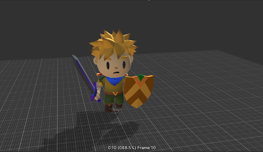

#### Animations
Character animations for Hercules include walk, run, jump, idle, and attack. Note: Enemies in the game are equipped with the same animations however, their attack sequences may differ depending on type of enemy or point in combat. 

#### Control Scheme
- **[W][A][S][D]** - Move up, left, down, right
- **[Space]** - Jump
- **[Shift]** - Sprint
- **[Left Mouse Click]** - Attack
- **[N]** - Next Instruction (when prompted)
- **[ESC] + [Left Mouse Click]** - Interact with UI

#### Player Rewards
After defeating each boss level (i.e. lion, hydra, etc.) a drop will appear for the player. If picked up/interacted with, the player will receive an item to commemorate the win. These ***items appear in the players item inventory and act as modifiers or buffs*** for the player which will gradually make them stronger so that they may be able to progress to the next boss with relative ease. Bosses are intended to be defeated in order of the famous labors however it is entirely possible to recieve items out of order with enough skill. 

### User Interface
The user interface is derived from a 2D fantasy/adventure card game asset pack but transformed into what is depicted below (See below for details).  

#### Main UI
The main UI is depicted below with clickable options for settings (temporarily unavailable), items, and quest information. In the top right of the screen the player is able to see their health as an integer (See below for image).
  
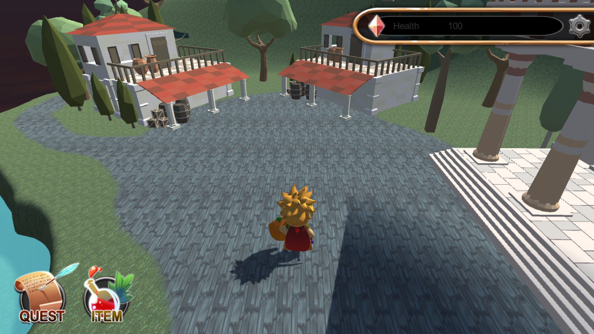

#### Settings
Settings can be acessed in the top right corner of the screen next to the health bar. Settings are temporarily unavailable and are there solely for aesthetic purposes rather than utility (See below for image).  

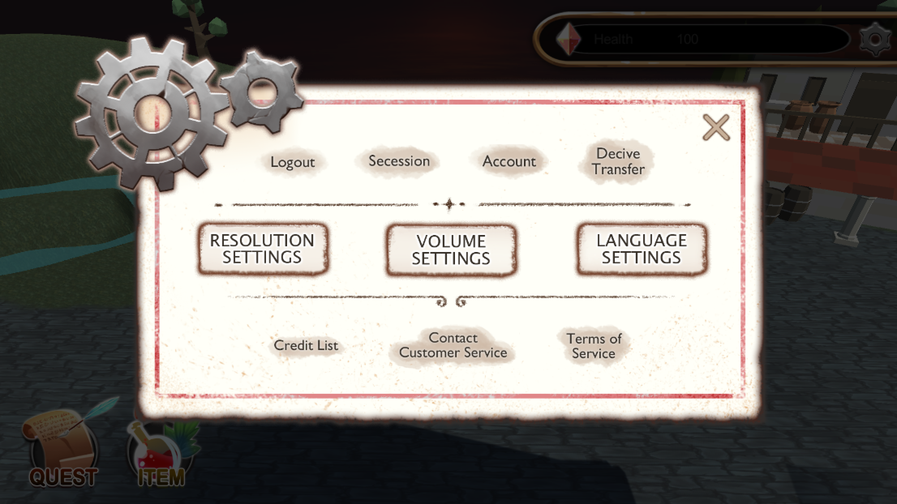

#### Items
Items can be accessed in the bottom left corner of the screen next to the option to access your quest. Items come from drops after defeating each major boss and can act as modifiers or buffs to your character to better prepare them for future bosses. Badges for collected items will be displayed in your items in the order of the labors. Once all items have been collected (every boss in the game defeated) the player will be victorious and have the option to play again (See below for image).
  
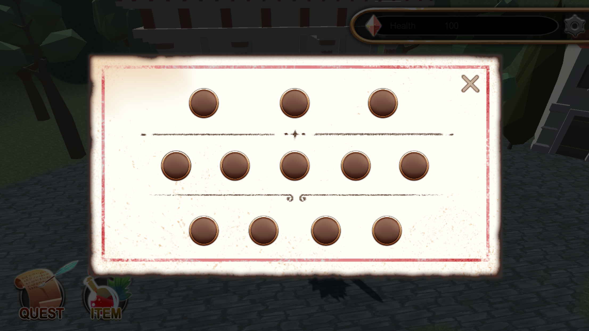

#### Quest
Your quest can be accessed in the bottom left corner of the screen next to the option to view your items. If you forget your quest at any time the full quest with Hercules' labors in order can be viewed from this menu (See below for image).
  
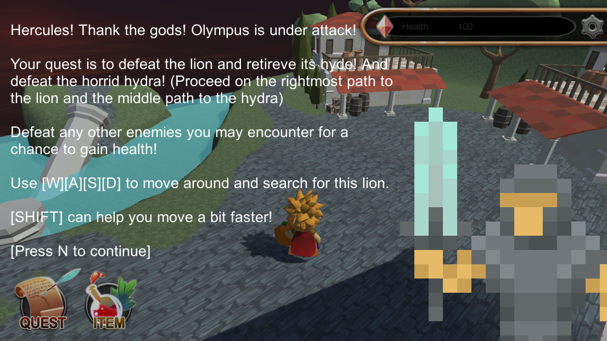

### Level Design
- **Hub** - Takes inspiration from both Greek and Roman architecture in its assets using Greek and Roman low poly lite packs. The Hub is the first place the player is introduced to and is the gateway to all levels.
- **Lion Cave** - Forest setting in which the player is tasked with learning how to fight (against foxes spread throughout the level) and parkour in order to chase down and defeat the lion in its cave.
- **Hydra Arena** - Arena setting in which the player enters the arena to be met with the Hydra–a stationary boss with crab minions that chase you throughout.

### Antagonistic Elements
Enemies and obstacles are categorized as follows:
  
- **Parkour** - In between levels there will be pillars or boxes to jump on to get across rivers as an additive to make the game a bit more interesting and interactive.
- **Bosses** - Two main bosses, the hydra and the lion that give objects to increase players chances of beating the game/help them defeat other bosses/minions
- **Minions** - Scattered across the world and in the boss fights to force the player to think critically, these minions–once defeated–can help boost your health as they drop health for the player.

Enemies the player will encounter throughout the game:

#### Lion
*Boss*

The lion utilizes a navmesh to navigate throughout different points on the terrain. The lion will roam around three different points in the level. As you fight the lion it will move onto the next point to mimic a retreat to the cave where the final battle sequence will take place (See below for image).

*Fun fact: this lion is actually a tiger that was repainted to look more like a lioness!*

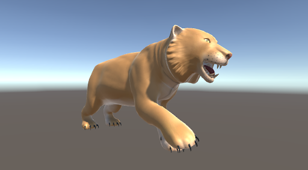

#### Foxes
*Minion*

Foxes will roam around different parts of the terrain in each level (except for the Hub) and have a chance to drop health for the player after defeat (See below for image).

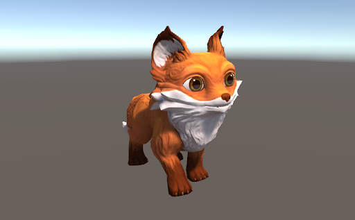

#### Hydra
*Boss*

The hydra is a stationary enemy with multiple heads. When attacking the hydra there is a chance that the hydra will summon crabs and another chance that the crabs waves that spawn will double in amount (See below for image).

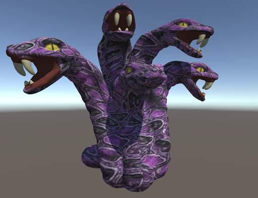

#### Crabs
*Minion*

Crabs come in waves throughout the hydra arena level and have a chance to double in amount while fighting the hydra. Crabs also have a chance to drop health within the level after defeat in order to help aid in defeating the hydra (See below for image).

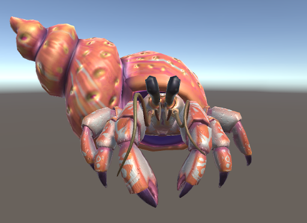

## Game Play
Main objectives of game play and game elements that allow for a better user experience:
  
- Defeat the main bosses and save the day! Complete all labors to complete the game. Progression is tracked by the objects collected after boss fights.
- Gameplay will be challenging due to the high hp of the bosses and minions that can take health during boss fights.
- Rewards include the sacred objects from the bosses that you pick up that give you benefits (ex: the impenetrable hyde as a defense buff) that will help you defeat other bosses.
- Things to make gameplay interesting include the addition of minions around the world and “puzzles” (ex: jumping across a lake/parkour to learn about jumping)
- The level difficulty will increase throughout the game by having the boss's health increase so that defeating them is made more difficult. AI will also change making the bosses tactics different and increasingly difficult.
  
Level specific objectives and descriptions:

### Hub
The Hub is the first "level" you encounter. It is the main area in which to orient yourself in. Here is where you will be given your quest. The Hub acts as the main entry point to all levels. Other than that just enjoy the scenery! (See below for image).
  
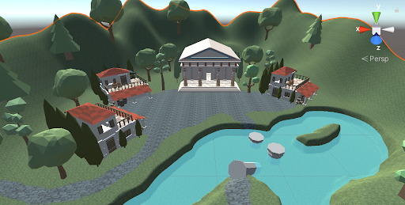

### Lion Cave
The Lion Cave is the first active level in the game in which you find yourself fighting off smaller enemies in the forest on the way to the lion. This acts as the tutorial level and serves as an introduction to fighting enemies and parkour! (See below for images).

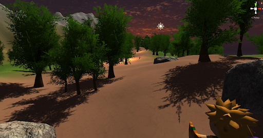
  
*Forest: battle foxes to practice and gain health before the main boss–the lion.*
  
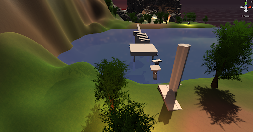
  
*Parkour: use pillars and other objects in the water to make it across the river toward the lion cave.*
  
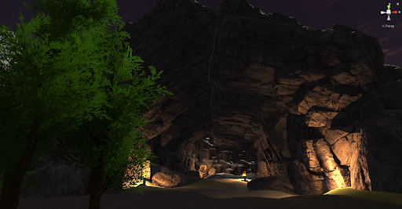
  
*Cave: the final phase of the level where the final showdown with the lion will occur. Will you be victorious?*

### Hydra Arena
The Hydra Arena is the second active level in the game in which you must enter the arena to face the hydra! The hydra level includes waves of crab minions within the boss fight that can double by chance while fighting the hydra. Crabs also drop health but be careful...the hydra has way more hp than the lion (See below for images).

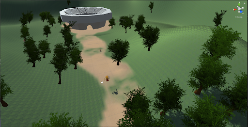
  
*Terrain: walk along the path and battle some more foxes for ny needed health before battling the hydra!*

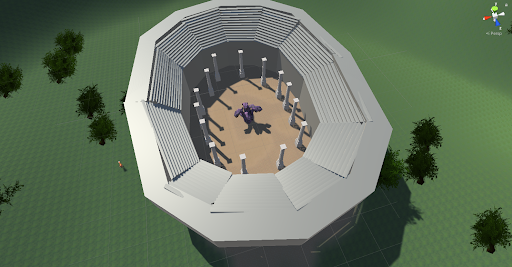
  
*Arena: a bird's eye view of the arena and the boss within.*
  
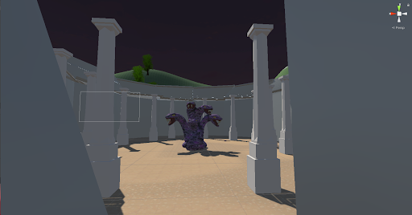
  
*Hydra: the hydra awaits as you enter the arena. Will you be victorious?*

## Contributors
Group members who contributed to this project as part of a game development course at Western Washington University.

## Thank You!
Thank you for checking out our game!
