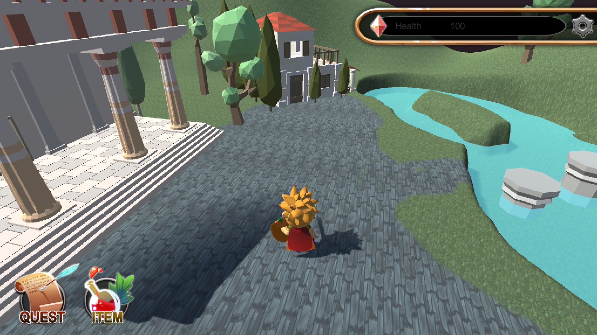

# The 12 Labors of Hercules
A 3D video game created in C# and Unity utilizing built-in renderers to create a 3D open-world game in which you play as Hercules and must complete the 12 Labors.

   

<!-- TABLE OF CONTENTS -->
<!-- 

  
Table of Contents

  <ol>
    <li><a href="#Program-Specification">Program Specification</a></li>
    <li>
      <a href="#Sample-Invocation">Sample Invocation</a>
      <ul>
        <li><a href="#help">!help</a></li>
        <li><a href="#pete">!pete</a></li>
      </ul>
    </li>
    <li>
      <a href="#Add-Pete-to-Your-Server">Add Pete to Your Server!</a>
      <ul>
        <li><a href="#Permissions">Permissions</a></li>
      </ul>
    </li>
    <li><a href="#Topgg">Top.gg</a></li>
    <li><a href="#Questions-or-Ideas">Questions or Ideas</a></li>
    <li><a href="#Thank-You">Thank You!</a></li>

 -->

## Overview

## Contributors
|  |  |  |
|     :---:      |     :---:      |     :---:      |
| Samantha Murray       | Ryan Turner       | Taryn Barnes       |
